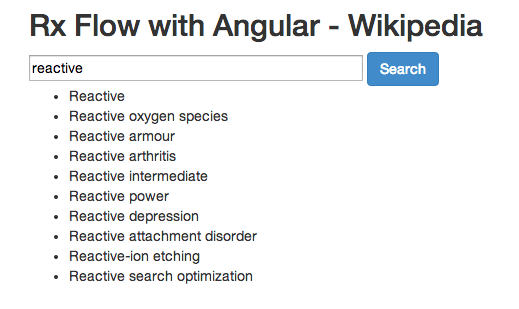

# Interaction Flows with RxJs

Inspired by [Microsoft's project](https://github.com/Reactive-Extensions/rx.angular.js) .

Definition (it works on any object):

      function createFlow(context, fnName, input, output, promiseProvider, procFn) {
        ...
       }

This will add a function <code>fnName</code> on the context, whose invocation will trigger a flow that will use the
<code>input</code> data and the promiseProvider to create a promise whose results will be used to populate the
<code>output</code> field, after transforming the promise value with the <code>procFn</code> function.

Usage with AngularJs:

    var dataProvider = function(term) {
            return $http({
                    url: "http://en.wikipedia.org/w/api.php?&callback=JSON_CALLBACK",
                    method: "jsonp",
                    params: {
                            action: "opensearch",
                            search: term,
                            format: "json"
                    }
            });
     }

     createFlow($scope, 'click', 'search', 'results', dataProvider, function(response) {return response.data[1]});

Angular's two-way binding is nicely complementing the interaction flow.

Such dynamic flows could be used to implement interaction contexts and roles in DCI. The <code>combineLatest</code>
operator of <code>Observable</code>s could be used to support multiple inputs.